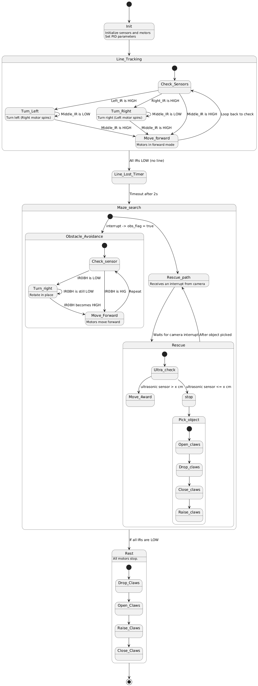

# Rescue Bot

This is a project on a robot that can navigate through a line following course and explore a Maze
to retrieve an object and bring it out of the maze.

## State Diagram

The project is divided in states according to the state diagram below.

## BOM

This project will require the following components:

| Component         | Quantity | Cost (USD) | Use Case                                  |
|-------------------|----------|------------|--------------------------------------------|
| Raspberry Pi Pico       | 1        |        | Main microcontroller for robot control     |
| L298N Motor Driver| 1        |         | Controls the motors                        |
| Geared DC Motors         | 1       |        | Drives the robot wheels                    |
| IR Sensors        | 4        |         | 3 for Line following and 1 obstacle detection      |
| Ultrasonic Sensor | 1        |         | Distance estimation                         |
| 4 wheeled Chassis           | 1        |         | Robot body                                 |
| Wheels            | 4        |         | Movement                                   |                                 |
| Battery Pack/ 3.7V Lion batteries      | 2         |          | Power supply                               |
| Jumper Wires      | 1 set    |          | Connections                                |
| Breadboard        | 1        |          | Prototyping                                |

## CAD designs

##
